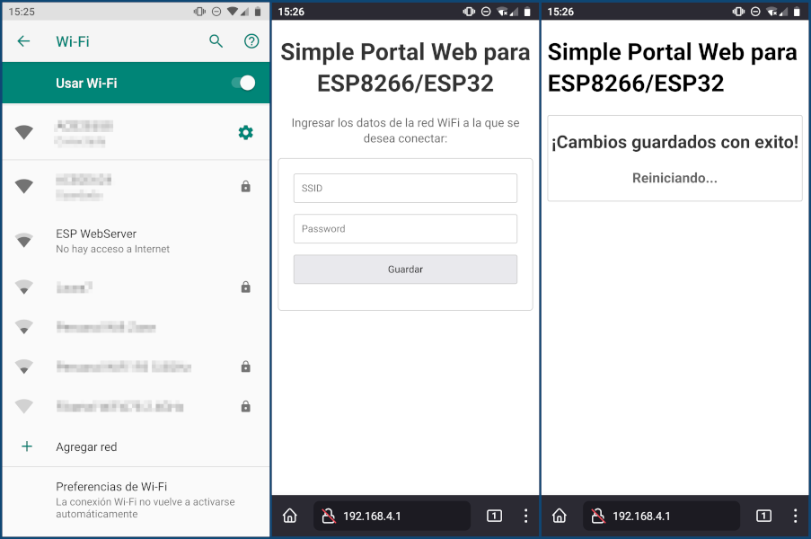
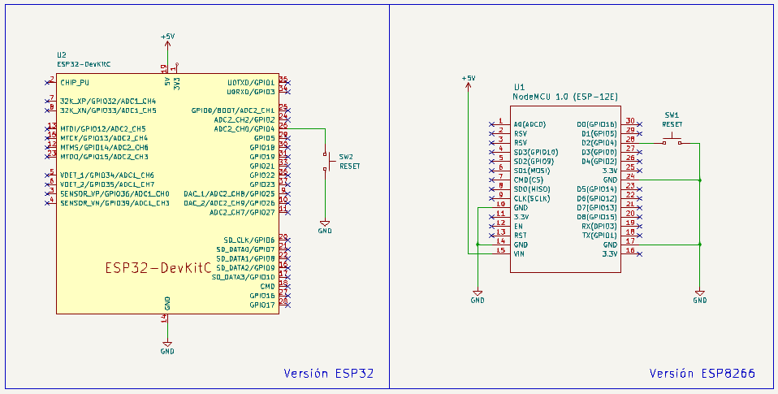

# Simple Portal Web para ESP8266/ESP32

Simple portal web para configurar las credenciales de una red WiFi en un dispositivo construido alrededor de un ESP8266 o de un ESP32.

Se trata de un pequeño [Captive Portal](https://en.wikipedia.org/wiki/Captive_portal) que permite configurar las credenciales WiFi, tanto el SSID (Service Set IDentifier) como la Password a un *usuario final* que tenga algún dispositivo IoT basado en el microcontrolador ESP8266 o ESP32.

Para acceder al portal hay que conectarse a la red WiFi que genera el ESP, por defecto el nombre de la red es `ESP WebServer`, y desde el navegador dirigirse a la IP `192.168.4.1`.



El funcionamiento del sistema es muy simple: 

1. Inicia el sistema con el encendido de la placa.
2. `wifiConnect()` intenta conectar durante 5 segundos utilizando las credenciales almacenadas en la memoria EEPROM interna, para luego ejecutar funciones auxiliares (como manejar un LED *Status*). En caso contrario, es decir si falla la conexión, invoca a `wifiAP()`.
3. `wifiAP()` genera una red WiFi para que el cliente se pueda conectar. Acto seguido deberá ingresar mediante el navegador a la dirección IP del Captive Portal, completar el formulario con los datos de la red a la que desea conectar el dispositivo y presionar el botón `Guardar`. El sistema se reiniciará y volverá a ejecutar el paso (1).
4. Es posible forzar el Captive Portal en caso de querer cambiar las credenciales almacenadas, para esto simplemente se pulsa el botón `RESET`. 

## Descripción del código

Para compilar el proyecto son necesarias las siguientes dependencias, incluidas en el *ESP8266 Arduino Core*:

- [ESP8266WebServer.h](https://github.com/esp8266/ESPWebServer)
- [ESP8266WiFi.h](https://github.com/esp8266/Arduino/tree/master/libraries/ESP8266WiFi)
- [EEPROM.h](https://github.com/esp8266/Arduino/tree/master/libraries/EEPROM)

Para el ESP32, también incluidas en el *core*:

- [WebServer.h](https://github.com/espressif/arduino-esp32/tree/master/libraries/WebServer)
- [WiFi.h](https://github.com/espressif/arduino-esp32/tree/master/libraries/WiFi)
- [EEPROM.h](https://github.com/espressif/arduino-esp32/tree/master/libraries/EEPROM)

El archivo `espWebCfg.h` contiene los prototipos de funciones, declaraciones de variables y constantes. Es la inclusión que se debe hacer en el archivo principal, por ejemplo `myFirmware.ino`. Además incorpora la línea `#define ENABLE_DEBUG 1` que permite activar (o no) el modo de depuración vía el monitor Serial. Por defecto esta activado, con `0` se desactiva. Además hay definidas algunas constantes útiles:

- `MAX_ATTEMPTS` es un multiplicar de tiempo para dar por finalizado los intentos fallidos de conexión y lanzar el Captive Portal.
- `RESET` se refiere al pin GPIO donde se encuentra conectado un pulsador *pull-down* para forzar el Captive Portal, por defecto es `GPIO04` / `G4` / `D2`.
- `BLINK_TIME` es el tiempo entre destellos del *Status LED*.
- `FLASH_LED` es el tiempo de encendido del *Status LED*.

El archivo `espSetupFunction.cpp` gestiona la configuración mediante la función `espSetup()`. La misma se debe incluir dentro de *setup()* en el archivo pricipal, por ejemplo `myFirmware.ino`.

El archivo `espLoopFunction.cpp` contiene la función `espLoop()` que ejecuta funciones auxiliares. La misma se debe incluir dentro de *loop()* en el archivo pricipal, por ejemplo `myFirmware.ino`. Ademas incorpora la función `blinkLed()` que se encarga de manejar el destello del *Status LED*, por defecto 100 ms cada 3 segundos.

El archivo `espWiFi.cpp` contiene prácticamente todo el código relacionado a la conectividad WiFi. Se utilizan dos objetos *String* para almacenar las credenciales WiFi: `wifiSsid` para el SSID y `wifiPassword` para la contraseña. La función `wifiConnect()` es la que maneja la conexión a la red WiFi.

El archivo `espWebServer.cpp` se encarga de generar una red WiFi mediante el modo Soft-AP del ESP, y servir las páginas del Captive Portal. Las funciones incluidas son las siguientes:

- `wifiAP()` Maneja el modo Soft-AP
- `handleRootGET()` Envía el Captive Portal
- `handleRootPOST()` Maneja las peticiones desde el browser

El archivo `html.cpp` contiene el código HTML que se utiliza en el Captive Portal. Actualmente hay dos páginas embebidas:

- `htmlConfig` Captive Portal
- `htmlSuccess` Mensaje luego de procesar el formulario

El archivo `espEEPROM.cpp` contiene el código relacionado al manejo de la memoria EEPROM interna que se utiliza para almacenar los datos ingresados de manera permanente. Hay disponibles dos constantes que permiten seleccionar las direcciones de la memoria a utilizar: `SSID_ADDRESS` para el SSID y `PASS_ADDRESS` para la contraseña.

Las funciones incluidas son las siguientes:

- `writeString(int address, const String &data)` Escribe un *String* en la dirección especificada
- `readString(int address)` Devuelve un *String* desde la dirección especificada
- `saveCredentials(const String &ssid, const String &password)` Almacena las credenciales WiFi

## Ejemplo de uso

El siguiente código Arduino permite comenzar un proyecto centrándose unicamente en la lógica que deberá llevar adelante el dispositivo, sin preocuparse por la gestión de la conexión.

```Cpp
#include "espWebCfg.h"

void setup() {
  espSetup();
}

void loop() {

  espLoop();

  /*
      Acá tu código...
      Considerar no utizar retardos bloqueantes (delay).
  */
}
```

## Hardware

Para las pruebas se utilizo una placa de prototipos [*NodeMCU*](https://es.wikipedia.org/wiki/NodeMCU) genérica, simplemente con un pulsador conectado en el `GPIO4`, según el siguiente diagrama de conexiones.



## ToDo

- [x] Agregar soporte para micros ESP32
- [ ] ¿Agregar soporte para Raspberry Pi Pico W?
- [ ] Validar los datos ingresados mediante los campos del formulario
- [x] Mejorar el diseño del portal HTML
- [ ] Documentar variantes de hardware

## Recursos

- [Páginas embebidas con ESP8266 (WebServer)](https://blog.tute-avalos.com/2022/08/26/paginas-embebidas-webserver-esp8266/)
- [ESP8266 Pinout Reference: Which GPIO pins should you use?](https://randomnerdtutorials.com/esp8266-pinout-reference-gpios/)
- [ESP8266 Arduino Core ](https://esp8266-arduino-spanish.readthedocs.io/es/latest/index.html)
- [ESP8266WiFi library](https://esp8266-arduino-spanish.readthedocs.io/es/latest/esp8266wifi/readme.html)
- [HTML5 y CSS3](https://www.html6.es/)